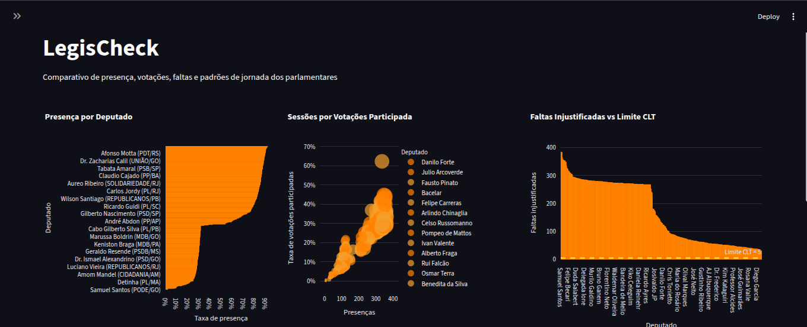
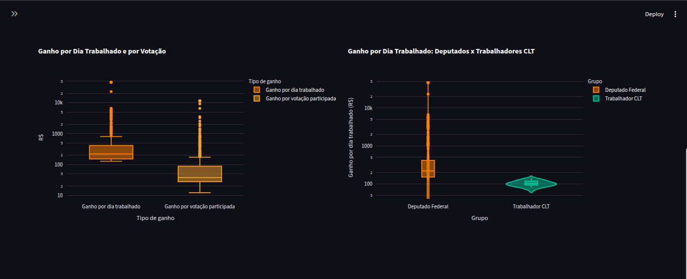

# Coleta análise e  preparação de dados.
### Trabalho extensionista PUCRS/2025-2

**Alunos:**

* Felipe Augusto Batista Mendes dos Santos

* Guilherme Couto de Castro

* Gustavo Henrique da Silva

* Thiago Farias dos Santos

---

**Objetivo Geral:**

Este trabalho extensionista consiste em realizar os processos de coleta, preparação e análise de dados sobre os dados abertos da Câmara dos Deputados, que contém
dados sobre gastos e atividade parlamentar dos deputados federais.

---


---

**Fase 1:**

Compreensão do Negócio – Apresentação da questão de pesquisa e etapa de seleção dos dados

**Fase 2:** 

Compreensão dos Dados – Apresentação de uma análise estatística e do planejamento da integração e limpeza dos dados:

**Fase 3:** 
Preparação dos Dados – Apresentação dos dashboards

- API link: https://dadosabertos.camara.leg.br/api/v2/
- API docs: https://dadosabertos.camara.leg.br/swagger/api.html

---

## Problema: 

Avaliar a quantidade de presenças, participações e faltas justificadas de cada deputado, aplicar diferentes filtros que aproximem o regime de trabalho praticado na Câmara com o regime CLT nestes dados e calcular o ganho efetivo por dia trabalhado de cada deputado, explorando a desigualdade entre tabalhadores e a classe política do Brasil.

## Solução: 

Demonstração gráfica através de Dashboards comparativos, expondo os privilégios assegurados aos deputados federais brasileiros para além dos ganhos financeiros, além de exibir e explorar outliers.

---

## Execução:

- **Estrutura:**

```
.
├── app
│   └── home.py
├── data
│   ├── info
│   │   ├── cod_situacao_deputados.json
│   │   ├── freq_eventos.csv
│   │   ├── ocupacoes.csv
│   │   └── remuneracoes.csv
│   ├── processed
│   │   ├── deputados.json
│   │   ├── eventos.csv
│   │   ├── presencas.csv
│   │   ├── votacoes_2020-01.csv
│   │   ├── votacoes_2020-02_2025-10_todas.csv
│   │   ├── votacoes_2020-02.csv
│   │   ├── votacoes_2020-03.csv
│   │   ├── votacoes_2020-04.csv
│   │   ├── votacoes_2020-05.csv
│   │   .
│   │   .
|   |   .
|   |
│   └── quality
│       └── descricao_arquivos.csv
├── docs
│   ├── images
│   │   ├── image-1.png
│   │   └── image.png
│   ├── relatorios
│   │   └── Relatório do Projeto Extensionista - Primeira Iteração.pdf
│   └── sobre
│       ├── fase1.md
│       ├── fase2.md
│       └── fase3.md
├── lab
│   ├── 01_coleta_dados.ipynb
│   ├── 02_descricao_dados.ipynb
│   ├── 03_analise_exploratoria.ipynb
│   ├── 04_verificacao_qualidade.ipynb
│   ├── resumo.txt
│   └── transform
│       └── tratamento.ipynb
├── README.md
├── requirements.txt
└── test.py
```

- **Requirements**

```python
# Criação do ambiente
conda create --name tde python=3.9

# Ativação de ambiente
conda activate tde

pip install -r requirements.txt

```

- **Run:**

```python
 streamlit app/home.py
```

 - **Observações:**

Você pode encontrar os relatórios detalhados de cada fase na pasta docs/relatorios/ e o desenvolvimento técnico nos notebooks da pasta lab/
 
- **Referências:**
